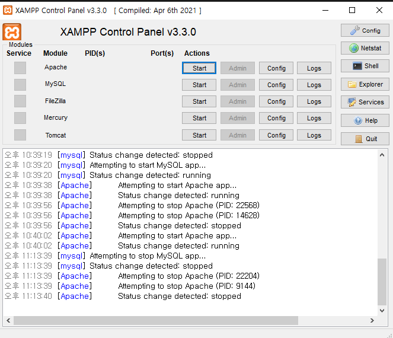
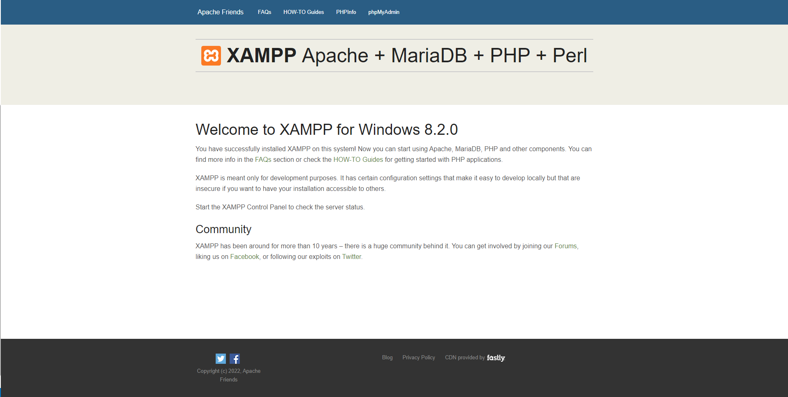
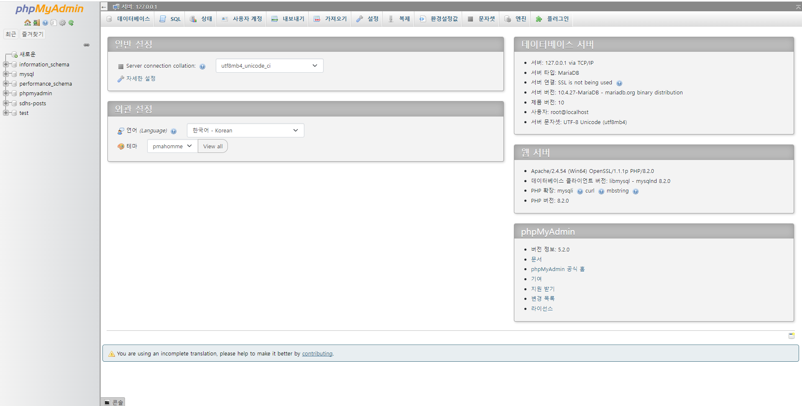

###### [back](../README.md)

#### xampp 설치 사이트

-   https://www.apachefriends.org/index.html

#### xampp 설치

-   xampp 설치 경로 : `C:\xampp`

xampp 폴더의 xampp-control 파일을 실행하면 아래와 같은 창이 나온다.  
또는 윈도우 검색창에서도 XAMPP Control Panel 을 실행하여 창을 띄울 수 있다.

#### xampp 설명

기능경기대회에서 xampp 를 사용해서 과제를 풀기 때문에 xampp 를 사용하게 되었음

대회에서 사용하는건 Apache, MySQL, phpMyAdmin 3가지만 사용하고

-   Apache : 웹서버
-   MySQL : 데이터베이스(DB)
-   phpMyAdmin : MySQL 을 웹 상에서 관리할 수 있는 도구

#### xampp 실행해보기

Apache 의 Start 버튼과 MySQL 의 Start 버튼을 클릭하면 서버가 실행된다.  
Admin 을 클릭하면 Apache 는 웹 사이트 그리고 MySQL 은 phpMyAdmin 으로 이동한다.

주의 : Apache 를 실행하지 않으면 phpMyAdmin 은 열리지 않는다.

#### Apache

Apache 가 실행되면 localhost 로 접근 시 아래와 같은 화면이 보이게 된다.

실행된 서버의 웹 파일은 `xampp/htdocs` 에 존재한다.  
htdocs 에서 웹 파일을 추가 할 경우 새로고침하면 새로 반영된다.

웹 서버 실행 시 바라보고 있는 폴더를 **DocumentRoot** 라고 한다.  
DocumentRoot 는 Apache Config 에서 임의로 변경이 가능하다.

#### phpMyAdmin

MySQL 을 실행하고 localhost/phpmyadmin 로 접근 시 아래와 같은 화면이 보이게 된다.

