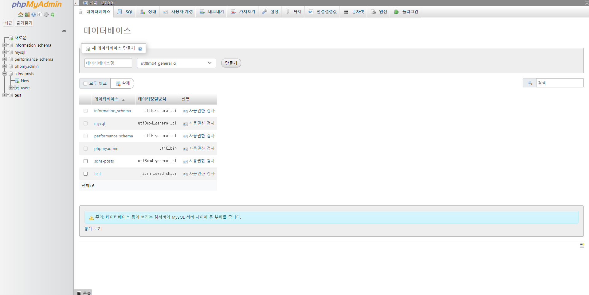
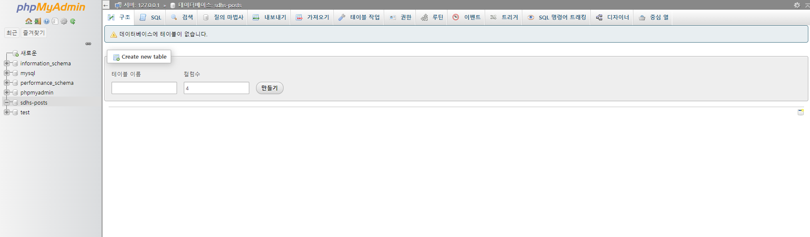
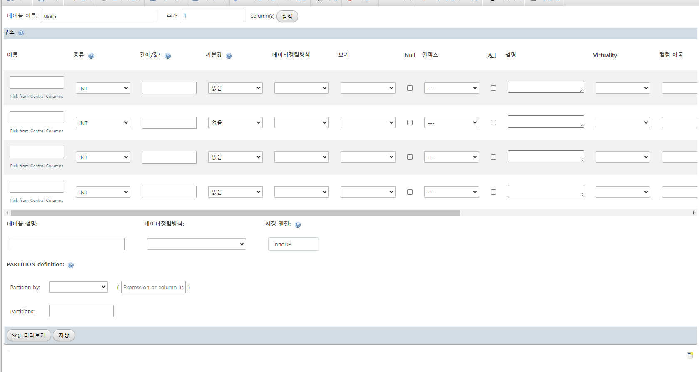
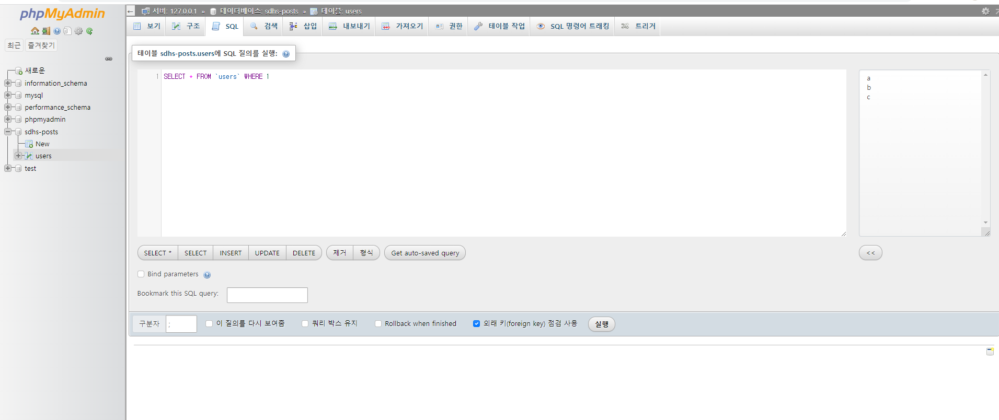

###### [back](../README.md)

#### Database(DB) 생성하기

`localhost/phpmyadmin` 페이지로 접근하면 DB 를 만드는 화면이 있다.  
생성할 데이터베이스명과 "utf8mb4_general_ci" 로 DB 를 만든다

#### DB Table 생성하기

DB 를 생성하고 좌측 메뉴에서 생성한 메뉴를 클릭하면 아래 화면처럼 보이며  
테이블을 생성할 수 있다. 컬럼 수는 높게 해도 생성할 때 비어있으면 제외된다.

만들기 버튼을 클릭하면 아래와 같은 화면으로 이동하게 되며,  
테이블의 구조(표) 의 형식을 만들면 된다.

#### DB Table 구조 설명

기능경기 대회에선 3가지만 알고 있으면 된다.

-   `이름` : 컬럼명이며 제목이라고 생각하면 된다.
-   `종류` : 컬럼의 타입이며 대회에서는 `int` `text` `date` 위주로 사용한다.
-   `A I(Auto Increment)` : 인덱스 없는 배열에 인덱스가 생긴다고 생각하면 된다.

#### PK, FK, UK

컬럼에 들어가는 특정 옵션 키 3가지  
기능 경기대회에서는 PK 와 UK 의주로만 사용한다

-   PK(Primay Key) : 표에서 값이 중복될 수 없고 빈값이 불가능하며, 하나의 컬럼에만 적용할 수 있다.
-   UK(Unique Key) : 표에서 값이 중복될 수 없고 빈값이 가능하며, 여러 컬럼에 적용이 가능하다.
-   FK(Foreign Key) : 다른 표의 컬럼을 참조하는 키이며, 여러 컬럼에 적용이 가능하다.

#### CRUD

테이블을 생성했으면 상단 SQL 탭을 클릭하면 아래와 같은 화면이 보이게 된다.

-   Create(생성) : `INSERT INFO 테이블이름 ('컬럼A','컬럼B') VALUES ('컬럼A값','컬럼B값')`
-   Read(읽기) : `SELECT * FROM 테이블이름 WHERE 컬럼A = 조건값`
-   Update(갱신) : `UPDATE 테이블이름 SET 컬럼A = 변경될값, 컬럼B = 변경될 값`
-   Delete(삭제) : `DELETE FROM 테이블이름 WHERE 컬럼A = 조건값 `
