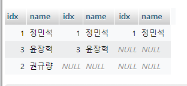

-   TableA
    | idx | name |
    | --- | ---- |
    | 0 | 정민석 |
    | 1 | 권규량 |
    | 2 | 윤장혁 |
-   TableB
    | idx | name |
    | --- | ---- |
    | 0 | 정민석 |
    | 1 | 윤장혁 |
    | 2 | 김연규 |
-   TableC
    | idx | name |
    | --- | ---- |
    | 0 | 정민석 |
    | 1 | 여준우 |

**inner join**

-   전부 일치하는것만 조회


```mysql
select * from a
 inner join b on a.name = b.name
 inner join c on b.name = c.name
```

**left join**

-   조건에 맞는 좌측 컬럼은 보여주고 일치하지 않는 부분은 NULL 처리
    

```mysql
select * from a
 left join b on a.name = b.name
 left join c on b.name = c.name
```

**right join**

-   조건에 맞는 우측 컬럼은 보여주고 일치하지 않는 부분은 NULL 처리
    

```mysql
select * from a
 right join b on a.name = b.name
 right join c on b.name = c.name
```

**outer join**

-   left join 과 right join 을 합친 것


```mysql
select * from a
 left join b on a.name = b.name
 left join c on b.name = c.name
UNION
select * from a
 right join b on a.name = b.name
 right join c on b.name = c.name
```
